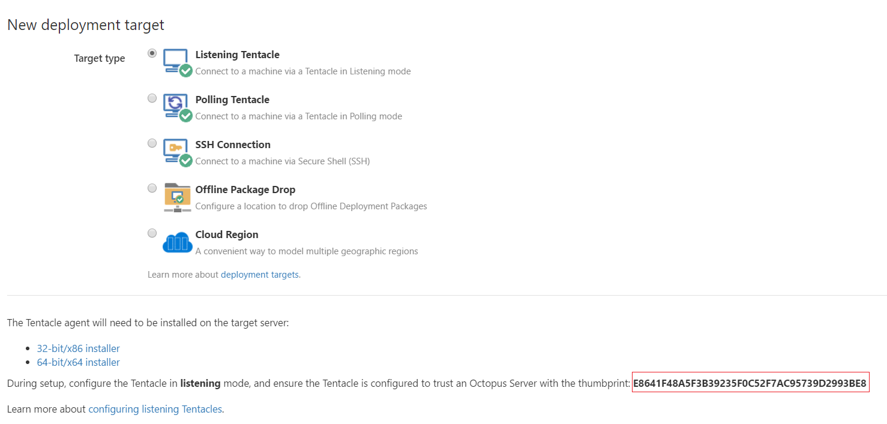

You may want to move only the Octopus Server itself, and continue using your existing database. The following process is the recommended approach. Skipping any step in this process can result in encryption errors or missing data and files.

## Some things to note prior to moving your Octopus instance
- You will need your master key in order for your new Octopus installation to connect to your existing database. You can retrieve and save a copy of the [master key](/docs/reference/security-and-encryption.md) in the Octopus Manager.
- Data that is stored in the file system needs to be moved over to the new server. These are your packages stored in the built-in package repository, your artifacts (includes project logos), and your Task Logs. 
- Tentacle thumbprints are stored in the database. If you’re using the same database, you won’t need to re-configure your Tentacles.

:::warning
You can only move your server to the same version,  you cannot move to an upgraded version. Either upgrade your existing server, then move the Server and files, or move then upgrade on the new server. Please refer to our [upgrading guides](/docs/administration/upgrading/index.md) for applicable information for your scenario.
:::

## Process

1. Place your Octopus instance into Maintenance Mode and stop the service when all deployments have completed. You can stop the service via the Octopus Manager, or via the command line using the following command.
`Octopus.Server.exe service --stop`
2. Ensure you have saved a copy of your [master key](/docs/reference/security-and-encryption.md#Securityandencryption-YourMasterKey).
3. Create a new Octopus instance using the same Octopus version as your original instance. You can find an older version and download the MSI in our [previous releases](https://octopus.com/downloads/previous) page.
4. During the installation of your new instance, select your existing database. It will prompt for the master key.
5. Copy the following directories from your original server to the new server (each of these folders are located in C:\Octopus in standard installations).
   - Artifacts
   - Task Logs
   - Packages
      - This folder only needs to be moved if using the built-in package repository. External feed details are stored in the database, and they will connect automatically.
6. Finally, restart your new Octopus instance to index the packages. You can restart either in your Octopus Manager, or via the command line with the following command.
```
Octopus.Server.exe service --stop
Octopus.Server.exe service --start
```

## Update Tentacle connection information when creating new database

When moving Octopus, if you create a new database, you will need to update your Tentacles to continue communicating with Octopus. Below are some instructions on how to update both Listening and Polling tentacles.

### Listening Tentacles

:::warning

Octopus stores its certificates in the SQL database. If you migrate your server to a new database, your Listening Tentacles will no longer be able to authenticate communication with the Octopus server.
:::

To update your Listening Tentacle's thumbprint to match your server's new thumbprint, you can run the following Tentacle.exe command. If you would like some further documentation on automating the installation and configuration of Tentacles, see the following documentation.

https://octopus.com/docs/api-and-integration/tentacle.exe-command-line/configure

```
cd "C:\Program Files\Octopus Deploy\Tentacle" # This is the default Tentacle installation directory

Tentacle.exe service --stop --console
Tentacle.exe configure --instance=VALUE --trust=NewThumbprintValue --remove-trust=OldThumbprintValue --console
Tentacle.exe service --start --console
```

You can find your new thumbprint in the web portal as shown in the following screenshot.



You can also find your new Octopus server thumbprint by using the [Octopus.Server](https://octopus.com/docs/api-and-integration/octopus.server.exe-command-line/show-thumbprint) `--show-thumbprint` command. 
```
cd "C:\Program Files\Octopus Deploy\Octopus" # This is the default Octopus Server installation directory

Octopus.Server.exe show-thumbprint
```

### Polling Tentacles

Our Polling Tentacles use a static address for their connection to the Octopus Server. If your server has moved and your static address/URL has changed, you will need to run the following [Tentacle.exe](https://octopus.com/docs/api-and-integration/tentacle.exe-command-line/register-with) command to update the Tentacle's `--server` value.

```
Tentacle.exe register-with --instance "Tentacle" --server "http://YOUR_OCTOPUS" --name "YOUR_TENTACLE_NAME" --apiKey "API-YOUR_API_KEY" --comms-style "TentacleActive" --server-comms-port "10943" --force --environment "YOUR_TENTACLE_ENVIRONMENTS" --role "YOUR_TENTACLE_ROLES" --console
```

:::warning
If you are running your Tentacle.exe commands from a Powershell remote session, make sure to add --console at the end of each command to force Tentacle.exe not to run as a service.
:::

If you would like some further documentation on automating the installation and configuration of Tentacles, see the [following documentation](https://octopus.com/docs/installation/installing-tentacles/automating-tentacle-installation).
